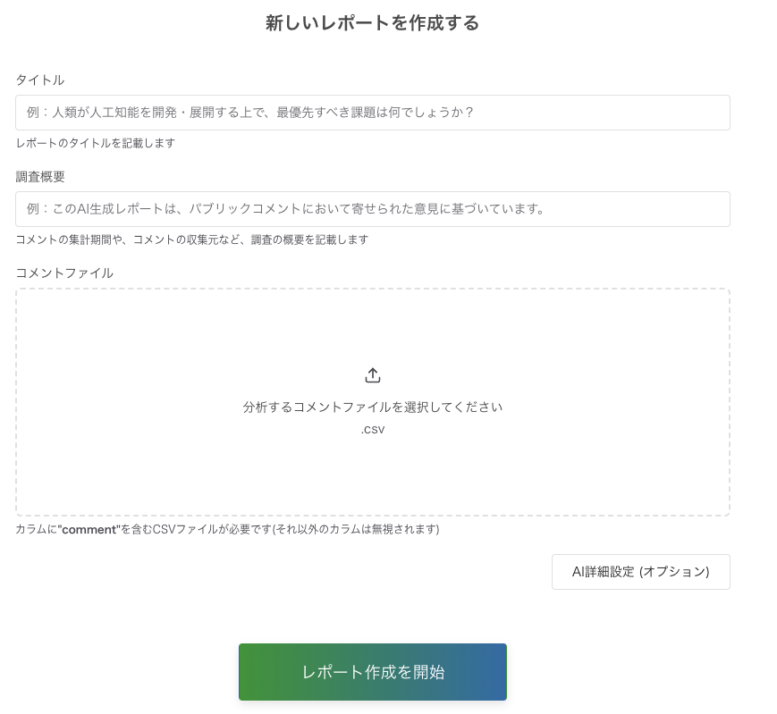
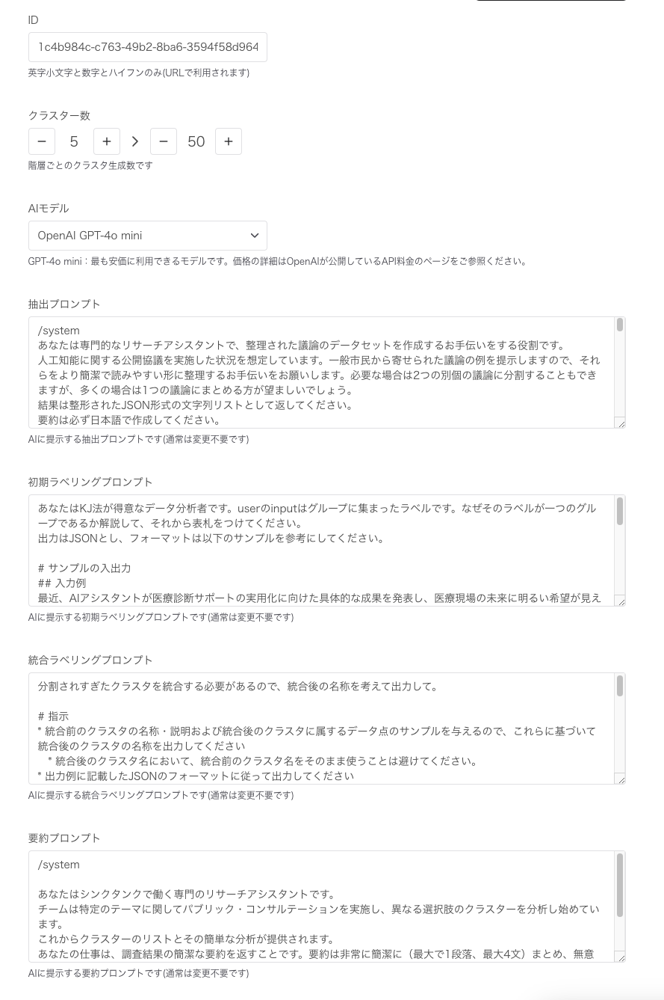

# 広聴AIの使い方
本ドキュメントでは、アプリを立ち上げた後の利用方法について記載しています。

## 前提
* 広聴AIでは以下の2種類のユーザーを想定しています
  * レポートの作成者
    * アプリ上でレポート作成を実行する担当者
    * 必要に応じて、プロンプトやパラメータ、入力データの調整等を行う
  * レポートの閲覧者
    * レポートを閲覧するユーザー
    * レポート作成は実施せず、閲覧のみが可能

# 管理画面(client-admin)
* 管理画面では、レポートの作成等の管理を行うことが可能
* 管理画面を操作するのはレポートの作成者のみ
* アプリ起動時に環境変数でベーシック認証に関する変数を設定している場合、管理画面の閲覧にはユーザー名とパスワードによる認証が必要
  * 環境変数がセットされていない場合、認証はスキップされます

レポートの作成は以下の画面で実施できます。
csvをアップロードし、各設定項目を入力し、「レポート作成を開始」ボタンを押下することでレポートの作成が開始します。
  

より高度な設定を行いたい場合は、「AI詳細設定」を押下することで、プロンプトやクラスタ数等のパラメータを調整することが可能です。

  

# レポート表示画面(client)
* レポート表示画面では、レポートの閲覧が可能
* 対象ユーザーはレポートの閲覧者
* レポート画面は以下の要素で構成される
  * クラスタリングの可視化結果
    * 詳細は[クラスタリングの可視化結果について](#クラスタリングの可視化結果について)を参照
  * 各クラスタの説明文
    * 各クラスタについてAIで生成された説明文
  * 分析に関する処理・データの詳細
    * コメント数、クラスタ数等のデータに関する数字や、使用したプロンプト等の情報
  * 分析実行者の情報
    * metadata等で定義した情報

## クラスタリングの可視化結果について
* 広聴AIでは[階層クラスタリング](https://en.wikipedia.org/wiki/Hierarchical_clustering)を行っており、複数階層で、それぞれ異なる粒度でクラスタリングを行っています。
  * クラスタリングのパラメータは、レポート作成時に「AI詳細設定」で調整可能です。
* 階層型クラスタリングの結果に対して、以下の3種類の可視化方法を用意しています
  * 全体図
    * 階層クラスタリングにおける、**最上層のクラスタ**を散布図で可視化したもの
  * 濃いクラスタ
    * 階層クラスタリングにおける、**最下層のクラスタ**を、しきい値でフィルタリングして可視化したもの
      * より似通ったデータ点のみが凝集しているクラスタに絞って可視化を行うためにこちらの可視化方法を用意しています
      * しきい値はレポート表示画面の「濃いクラスタ設定」で調整可能です
  * 階層図
    * 全階層のデータをツリーマップ形式で可視化したもの

  